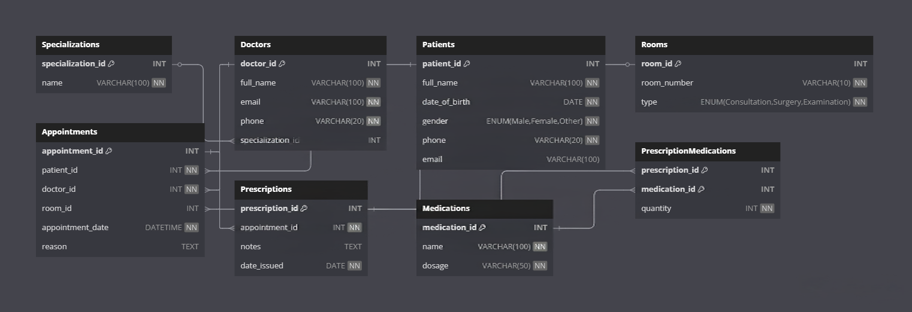

# 🏥 Clinic Booking System

## 📌 Project Overview

This project is a **Clinic Booking System** implemented using **MySQL**. It simulates the data management required by a real-world clinic, including managing:

- Patients
- Doctors and their specializations
- Appointment scheduling
- Room assignments
- Prescriptions and medications

It demonstrates a normalized relational schema using proper SQL constraints, joins, and sample data to facilitate testing and learning.

---

## 📁 Project Structure

```
clinic-booking-system/
│
├── clinic_booking_system.sql  # SQL schema (tables + constraints)
├── clinic_erd.png             # ERD image
├── README.md                  # Project documentation
```

---

## 🧠 Features

- Manage patients with personal and contact information.
- Doctors with unique emails and linked specializations.
- Room assignments for different types of appointments.
- Create and track appointments with timestamp, room, and reason.
- Prescription and medication management with quantity tracking.
- Includes realistic **sample data** to test queries.

---

## 🛠️ Technologies Used

- **Database**: MySQL Workbench
- **Design Tool**: dbdiagram.io (for ERD)

---

## 🗂️ Database Schema Summary

### Tables:
- `Specializations`
- `Doctors`
- `Patients`
- `Rooms`
- `Appointments`
- `Prescriptions`
- `Medications`
- `PrescriptionMedications` (junction table)

### Relationships:
- A **doctor** belongs to a **specialization**.
- A **patient** can have many **appointments**.
- An **appointment** is linked to a **room**.
- An **appointment** can have a **prescription**.
- A **prescription** can contain many **medications**.

---

## 🔧 Setup Instructions

1. Clone the repo:
    ```bash
    git clone https://github.com/<your-username>/clinic-booking-system.git
    cd clinic-booking-system
    ```

2. Open your MySQL terminal or use a tool like MySQL Workbench.

3. Run the `.sql` file:
    ```sql
    SOURCE clinic_booking_system.sql;
    ```

---

## 📊 ERD Diagram



---

## 📎 Sample Queries

### List all upcoming appointments with patient and doctor names:
```sql
SELECT 
  a.appointment_date,
  p.full_name AS patient,
  d.full_name AS doctor
FROM Appointments a
JOIN Patients p ON a.patient_id = p.patient_id
JOIN Doctors d ON a.doctor_id = d.doctor_id
ORDER BY a.appointment_date;
```

---

## 🧾 License

This project is open-source and free to use for educational and non-commercial purposes.

---

## 🙋‍♀️ Author

👩 **Barbra Wendy**  
PLP Student  
GitHub: [@barbpic](https://github.com/barbpic)

---

## 🏁 Final Notes

This project is ideal for students learning:

- Relational database design.
- SQL constraints (PK, FK, UNIQUE, NOT NULL).
- ER modeling and data normalization.
- Practical SQL testing with real-life examples.

Feel free to fork and expand it further.
