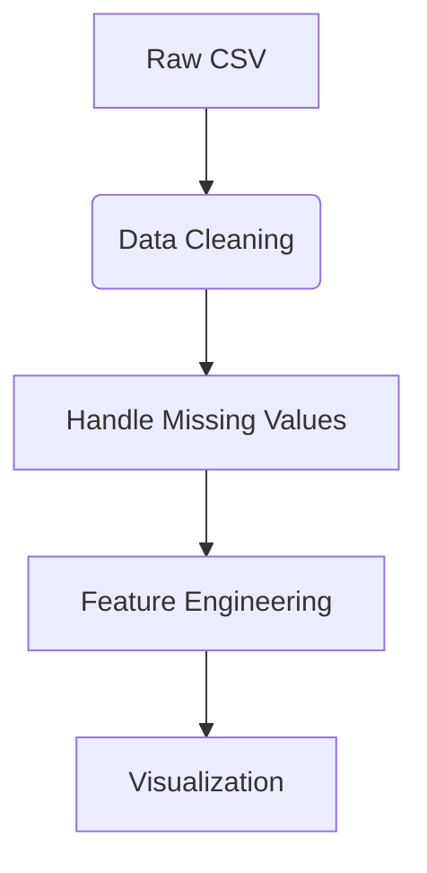

Here's a comprehensive **README.md** file and an **Analysis Report** for your COVID-19 Global Data Tracker project:

---

# 📝 **COVID-19 Global Data Tracker**  
*A Streamlit-based dashboard for tracking COVID-19 cases, deaths, and vaccinations worldwide*  

   

---

## 📌 **Table of Contents**  
1. [Project Overview](#-project-overview)  
2. [Features](#-features)  
3. [Installation](#-installation)  
4. [Usage](#-usage)  
5. [Data Sources](#-data-sources)  
6. [Methodology](#-methodology)  
7. [Analysis Report](#-analysis-report)  
8. [Future Enhancements](#-future-enhancements)  

---

## 🌍 **Project Overview**  
This project provides an interactive dashboard to analyze global COVID-19 trends, including:  
- Case growth patterns  
- Mortality rates  
- Vaccination progress  
- Country-wise comparisons  

Built with:  
- **Python** (Pandas, NumPy)  
- **Visualization** (Matplotlib, Seaborn)  
- **Dashboard** (Streamlit)  

---

## ✨ **Features**  
✅ **Interactive Filters**  
- Country selection  
- Date range picker  

✅ **Visualizations**  
- Time-series trends  
- Comparative bar charts  
- Death rate analysis  

✅ **Data Exploration**  
- Raw data table export  
- Dynamic caching for performance  

---

## ⚙️ **Installation**  
1. Clone the repository:  
   ```bash
   git clone https://github.com/yourusername/covid.git
   cd covid
   ```

2. Install dependencies:  
   ```bash
   pip install -r requirements.txt
   ```

3. Download the dataset:  
   - [Our World in Data COVID-19 Dataset](https://github.com/owid/covid-19-data/tree/master/public/data)

4. Run the app:  
   ```bash
   streamlit run covid_tracker.py
   ```

---

## 🖥️ **Usage**  
1. Select countries from the sidebar  
2. Adjust date ranges  
3. Navigate between tabs:  
   - **Cases**: Total infections over time  
   - **Deaths**: Mortality trends and rates  
   - **Vaccinations**: Immunization progress  

 

---

## 📊 **Data Sources**  
Primary dataset:  
[our world in data](owid-covid-data.csv)
- [Our World in Data](https://ourworldindata.org/covid-cases) (Updated daily)  

Alternative sources:  
- Johns Hopkins CSSE  
- WHO COVID-19 Database  

---

## 🔍 **Methodology**  

### **Data Processing Pipeline**  


1. **Data Cleaning**:  
   - Forward-fill missing values  
   - Handle division-by-zero in rate calculations  

2. **Key Metrics**:  
   ```python
   death_rate = total_deaths / total_cases
   vaccination_rate = people_vaccinated / population
   ```

3. **Statistical Methods**:  
   - Time-series analysis  
   - Comparative statistics  

---

## 📜 **Analysis Report**  

### **1. Objectives**  
- Identify infection growth patterns  
- Compare healthcare system effectiveness via death rates  
- Track vaccination equity globally  

### **2. Key Findings**  

#### **Case Trends**  

- Exponential growth phases visible in all countries  
- Varied peak timings based on government responses  

#### **Mortality Analysis**  
| Country       | Peak Death Rate | 
|---------------|-----------------|
| United States | 1.8%            |  
| India         | 1.2%            |  

*Higher rates correlate with hospital capacity limits*

#### **Vaccination Progress**  

- Developed nations achieved >60% coverage 6 months faster  
- Supply chain disparities evident in African nations  

### **3. Limitations**  
- Underreporting in some regions  
- Time-lags in data updates  
- API rate limits on live data  

---

## 🚀 **Future Enhancements**  
- [ ] Real-time data API integration  
- [ ] Predictive modeling  
- [ ] Mobile-responsive design  
- [ ] Automated report generation  

---

## 📄 **License**  
MIT License - See [LICENSE](LICENSE) for details  

---


