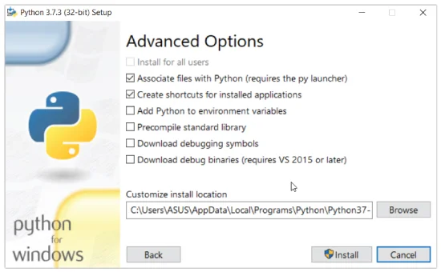

# Welcome to Python Development 🤘

Python is not just a language, it’s a superpower.

In this course, you’ll go from writing your first line of code to building cool projects that’ll make you say, ‘Wow, I did that! 😎’

Whether you’re totally new to coding or just looking to sharpen your Python skills, get ready for an epic journey filled with coding magic, challenges, and lots of fun moments.

---

## Python Language Quick Overview

Python is a high-level, interpreted programming language that is widely used for many different purposes, from web development to scientific computing to machine learning.

### Why Choose Python?

- **Easy to learn**: Python has a relatively simple syntax, which makes it easier for beginners to learn compared to other programming languages.
- **Versatile**: Python can be used for a wide range of applications, including web development, data analysis, artificial intelligence, and more.
- **Large and active community**: There is a large and active community of Python developers, which means that there are many resources available for learning and solving problems.
- **Plenty of libraries**: Python has a large number of libraries, including NumPy, pandas, and Matplotlib, which can be used to perform complex tasks with just a few lines of code.
- **Cross-platform compatibility**: Python can run on multiple operating systems, including Windows, macOS, and Linux, making it a good choice for projects that need to be run on multiple platforms.

---

## Install Python3 and VS Code on a Windows Machine

[Watch the tutorial](https://youtu.be/T8gaohdqDBA)

### Install Python

If you don't want to use Thonny, here's how to install and run Python on your computer:

1. Download the latest version of Python.
2. Run the installer file and follow the steps to install Python.
3. During the installation process, check **Add Python to environment variables**. This will add Python to environment variables, and you can run Python from any part of the computer.
4. Optionally, choose the path where Python is installed.



> **Note**: For Unix-based operating systems like Linux and macOS, Python is pre-installed.

---

# DAY 2: All About Python Variables 🧠💡

[Watch the tutorial](https://youtu.be/niQITQB3lEU)

### What is a Variable?

In programming, a variable is a container (storage area) to hold data. For example:

```python
number = 10
```

Here, `number` is the variable storing the value `10`.

### Assigning Values to Variables in Python

```python
site_name = "Power Learn Project"
print(site_name)
```

In the above example, we assigned the value `'Power Learn Project'` to the `site_name` variable. Then, we printed out the value assigned to `site_name`.

> **Note**: Python is a type-inferred language, so you don't have to explicitly define the variable type. It automatically knows that `'Power Learn Project'` is a string and declares the `site_name` variable as a string.

### Changing the Value of a Variable in Python

```python
site_name = "Power Learn Project"
print(site_name)

# Assigning new value to site_name
site_name = "I love coding 😊"
print(site_name)
```

**Output:**
```
Power Learn Project
I love coding 😊
```

Here, the value of `site_name` is changed from `'Power Learn Project'` to `'I love coding 😊'`.

### Assigning Multiple Values to Multiple Variables

```python
a, b, c = 5, 7, "Hello world"
print(a)  # prints 5
print(b)  # prints 7
print(c)  # prints Hello world
```

### Rules for Naming Python Variables

- Variable names can include letters (a-z, A-Z), digits (0-9), and underscores (_).
- Examples:
    - `snake_case`
    - `MACRO_CASE`
    - `camelCase`
    - `CapsWords`
- Python is case-sensitive. For example:
    ```python
    num = 55
    Num = 510
    print(num)  # 55
    print(Num)  # 510
    ```
- Avoid using Python keywords like `if`, `True`, `class`, etc., as variable names.

### More Resources

- [Real Python: Python Variables](https://realpython.com/python-variables/)
- [Simplilearn: Python Variables](https://www.simplilearn.com/tutorials/python-tutorial/python-variables)
- [Guru99: Variables in Python](https://www.guru99.com/variables-in-python.html)
- [TutorialsPoint: Python Variables](https://www.tutorialspoint.com/python/python_variables.htm)

---

# DAY 3: Understanding Python Datatypes

[Watch the tutorial](https://youtu.be/0rw3AEWLSaI)

### What are Data Types?

Data types specify the type of data that can be stored inside a variable. For example:

```python
num = 24
```

Here, `24` (an integer) is assigned to the `num` variable. So the data type of `num` is of the `int` class.

### Python Data Types Overview

| Data Types   | Class                | Description                              |
|--------------|----------------------|------------------------------------------|
| Numeric      | `int`, `float`, `complex` | Holds numeric values                     |
| String       | `str`                | Holds sequence of characters             |
| Sequence     | `list`, `tuple`, `range` | Holds collection of items               |
| Mapping      | `dict`               | Holds data in key-value pair form        |
| Boolean      | `bool`               | Holds either `True` or `False`           |
| Set          | `set`                | Holds collection of unique items         |

Since everything is an object in Python, data types are actually classes, and variables are instances (objects) of these classes.

---

# DAY 4: Python Operators

Operators are special symbols that perform operations on variables and values.

### Types of Python Operators

1. **Arithmetic Operators**
2. **Assignment Operators**
3. **Comparison Operators**
4. **Logical Operators**
5. **Bitwise Operators**
6. **Special Operators**

#### 1. Arithmetic Operators

| Operator | Operation         | Example       |
|----------|-------------------|---------------|
| `+`      | Addition          | `5 + 2 = 7`   |
| `-`      | Subtraction       | `4 - 2 = 2`   |
| `*`      | Multiplication    | `2 * 3 = 6`   |
| `**`     | Exponentiation    | `4 ** 2 = 16` |
| `/`      | Float Division    | `4 / 2 = 2`   |
| `//`     | Floor Division    | `10 // 3 = 3` |
| `%`      | Modulus (Remainder) | `5 % 2 = 1` |

#### 2. Assignment Operators

| Operator | Example | Same As       |
|----------|---------|---------------|
| `=`      | `x = 5` | `x = 5`       |
| `+=`     | `x += 3`| `x = x + 3`   |
| `-=`     | `x -= 3`| `x = x - 3`   |

#### 3. Comparison Operators

| Operator | Name              | Example   |
|----------|-------------------|-----------|
| `==`     | Equal             | `2 == 2`  |
| `!=`     | Not equal         | `4 != 2`  |
| `>`      | Greater than      | `5 > 3`   |

---

# DAY 5: Beginner-Friendly Projects

1. **Personalized Greeting App** 👋  
     Create a program that asks for the user’s name and favorite color, then prints a personalized greeting like:  
     `"Hello, [Name]! Your favorite color, [Color], is awesome!"`

2. **Simple Quiz Game** 🎮  
     Create a multiple-choice quiz with questions about Python, movies, or any fun topic! Display scores at the end and allow the user to play again. 🏆

3. **Random Joke Generator** 🤣  
     Build a program that stores a list of jokes and randomly selects one to display every time the user runs it. Add a fun twist with jokes about Python or programming! 🐍💡
