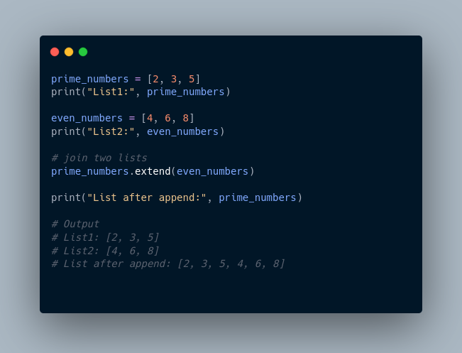
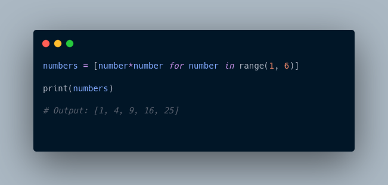

```markdown
# Python Data Structures and Strings

## Day 1: Introduction to Data Structures

So far, you have only stored small bits of data in a variable. This was either an integer, Boolean, or a string.  

But what happens if you need to work with more complex information, such as a collection of data like a list of people or a list of companies? Data structures are designed for this very purpose.  


A data structure allows you to organize and arrange your data to perform operations on them. Python has the following built-in data structures: **List**, **Dictionary**, **Tuple**, and **Set**. These are all considered non-primitive data structures, meaning they are classed as objects.  

Along with the built-in data structures, Python allows users to create their own, such as **Stacks**, **Queues**, and **Trees**. Each data structure can be designed to solve a particular problem or optimize a current solution to make it more performant.

### Mutability and Immutability

- **Mutable**: Data inside the structure can be modified (e.g., List).
- **Immutable**: Data cannot be modified once set (e.g., Tuple).

---

## Day 2: Python Lists

### Creating a Python List

A list is created in Python by placing items inside `[]`, separated by commas. For example:  


A list can have any number of items and they may be of different types (integer, float, string, etc.).  


### Accessing List Elements

Each item in a list is associated with an index number starting from `0`.  


### Slicing a List

You can access a section of items using the slicing operator `:`.  


### Adding Elements to a List

1. **Using `append()`**: Adds an item at the end of the list.  
2. **Using `extend()`**: Adds all items of one list to another.  


### Changing List Items

Lists are mutable, so you can change items by assigning new values.  


### Removing Items from a List

1. **Using `del`**: Removes one or more items.  
2. **Using `remove()`**: Deletes a specific item.  


### Python List Methods

Python provides many useful methods for lists.  


### Iterating Through a List

You can use a `for` loop to iterate over list elements.  


### List Comprehension

A concise way to create lists.  


---

## Day 3: Python Tuples

A tuple is similar to a list, but it is **immutable**.  

### Creating a Tuple

Tuples are created using `()`.  


### Accessing Tuple Elements

1. **Indexing**: Access elements using their index.  
2. **Negative Indexing**: Access elements from the end.  


### Tuple Methods

Tuples have limited methods since they are immutable.  


---

## Day 4: Python Sets

A set is a collection of **unique** data.  

### Creating a Set

Sets are created using `{}` or the `set()` function.  


### Adding and Updating Set Items

- **`add()`**: Adds a single item.  
- **`update()`**: Adds multiple items from other collections.  


### Removing Set Items

- **`discard()`**: Removes a specified item.  


### Set Operations

1. **Union (`|`)**: Combines all elements from two sets.  
2. **Intersection (`&`)**: Finds common elements.  
3. **Difference (`-`)**: Finds elements in one set but not the other.  
4. **Symmetric Difference (`^`)**: Finds elements in either set but not both.  


---

## Day 5: Python Strings

A string is a sequence of characters enclosed in single or double quotes.  

### Accessing String Characters

1. **Indexing**: Access characters using their index.  
2. **Negative Indexing**: Access characters from the end.  
3. **Slicing**: Access a range of characters.  


### String Operations

- **Concatenation**: Use `+` to join strings.  
- **Membership Test**: Use `in` to check if a substring exists.  


### String Methods

Python provides various methods to manipulate strings.  


### Escape Sequences

Use `\` to include special characters in strings.  


### String Formatting

Use **f-strings** for easy string formatting.  


---

## Additional Resources

- [Python Lists and Tuples](https://www.knowledgehut.com/tutorials/python-tutorial/python-lists-tuples)
- [Python Dictionaries](https://realpython.com/python-dicts/)
- [Python Sets](https://realpython.com/python-sets/)
- [Python Strings](https://www.geeksforgeeks.org/python-string/)
```
