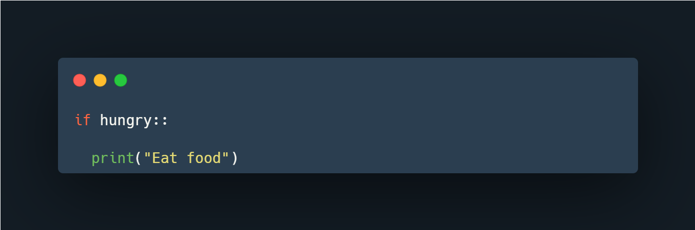

# Conditional Statements

As you start this lesson, ensure you have a good understanding of boolean variables and expressions since they are the building blocks of conditional statements.

Conditional statements help in decision-making. For example:

> "Are you hungry? If so, then eat" is a conditional statement.

Phrased as:  
- If you’re hungry, then eat.

### Breaking Down the Example
- **Boolean Expression**: "Are you hungry?"  
    The conditional statement checks if it’s `True`.  
    - If `True`, you will eat.
    - If `False`, you won’t eat.

```python
# Example
if hungry:
        eat_food()
```



In programming, we use the `if` statement to run a block of code only when a condition is met.

---

## Forms of `if...else` Statements in Python

### 1. Python `if` Statement

**Syntax**:
```python
if condition:
        # Code block
```

**Example**:
```python
temperature = 30

if temperature > 25:
        print("It's a hot day!")
```

- If the condition evaluates to `True`, the code inside the `if` block is executed.
- If the condition evaluates to `False`, the code inside the `if` block is skipped.

[Practice with relational and boolean operators](https://youtu.be/5DfYajSQOFY).

---

### 2. Python `if...else` Statement

**Syntax**:
```python
if condition:
        # Code block 1
else:
        # Code block 2
```

**Example**:
```python
temperature = 20

if temperature > 25:
        print("It's a hot day!")
else:
        print("It's a cool day!")
```

- If the condition evaluates to `True`, the `if` block is executed.
- If the condition evaluates to `False`, the `else` block is executed.

[Learn more about `if...else` statements](https://youtu.be/5DBbf65_nck).

---

### 3. Python `if...elif...else` Statement

**Syntax**:
```python
if condition1:
        # Code block 1
elif condition2:
        # Code block 2
else:
        # Code block 3
```

**Example**:
```python
temperature = 15

if temperature > 25:
        print("It's a hot day!")
elif temperature > 15:
        print("It's a warm day!")
else:
        print("It's a cold day!")
```

- The `if` block is executed if `condition1` is `True`.
- If `condition1` is `False`, `condition2` is evaluated.
- If all conditions are `False`, the `else` block is executed.

---

### Test Yourself

Write an `if/elif/else` statement for a college grading system:

- If grade is 90 or higher, print "A".
- Else if grade is 80 or higher, print "B".
- Else if grade is 70 or higher, print "C".
- Else if grade is 60 or higher, print "D".
- Else, print "F".

---

### Additional Resources
- [Python `if...elif...else`](https://www.programiz.com/python-programming/if-elif-else)
- [Codecademy: Python Conditionals](https://www.codecademy.com/resources/docs/python/conditionals)
